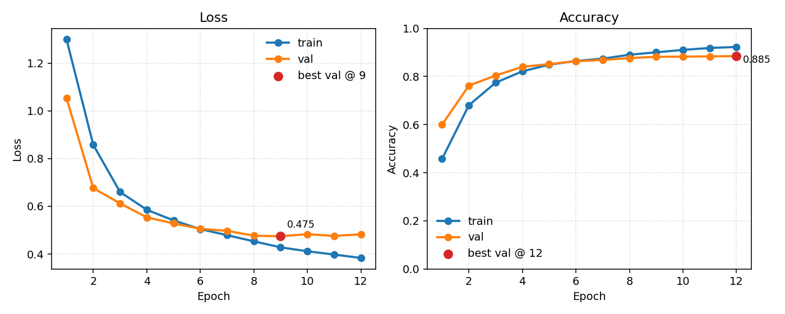

# Analisi del tono di testi in inglese 
## 📌 Project Work

Questo repository implementa il **Project Work conclusivo** del percorso [Python, Deep Learning e Computer Vision – AI Schools](https://aischools.it/) tenutosi dal 25 Agosto al 12 Settembre 2025.

L’obiettivo del progetto è sviluppare e valutare un modello BiGRU per l’analisi dei toni su testi in lingua inglese su quattro classi (neutral, polite, professional e casual) includendo:

- Preprocessing e costruzione del vocabolario a partire dai dataset di training e test  
- Training con early stopping
- Valutazione su set di test tramite accuratezza, macro-F1 e matrice di confusione  
- Salvataggio dei pesi migliori e generazione dei grafici di apprendimento

### 🧩 Architettura del modello

Di seguito uno schema della classe `BiGRUClassifier` implementata in `models/gru.py` e dei suoi componenti principali.


- Embedding layer per trasformare token IDs in vettori
- BiGRU bidirezionale multi-layer per catturare contesto sequenziale
- Pooling configurabile per aggregare le rappresentazioni temporali
- MLP opzionale per proiezione intermedia
- Linear finale per classificazione multi-classe

## 🚀 Installazione

Assicurati di avere installato **Python 3.9 o superiore**  
(Puoi scaricarlo dalla [pagina ufficiale di Python](https://www.python.org/downloads/)).

Il progetto utilizza **PyTorch** come libreria principale.  
Poiché l’installazione di PyTorch dipende dal sistema operativo e dal supporto GPU/CPU, è consigliabile seguire le [istruzioni ufficiali di PyTorch](https://pytorch.org/get-started/locally/) per scegliere il comando più adatto al tuo ambiente.

### Installazione

```bash
# 1️⃣ Creazione e attivazione di un ambiente virtuale
python3 -m venv venv
source venv/bin/activate   # (Windows: venv\Scripts\activate)

# 2️⃣ Installazione di PyTorch
# Segui le istruzioni ufficiali per il tuo sistema operativo e hardware
# Esempio: Mac con supporto MPS (Apple Silicon)
pip install torch torchvision

# 3️⃣ Installazione di numpy e matplotlib:
pip install numpy matplotlib
```

In alternativa, per installare tutte le dipendenze elencate in `requirements.txt` e riprodurre l'ambiente di sviluppo (MacBook Pro M4):

```bash
# 1️⃣ Creazione e attivazione di un ambiente virtuale
python3 -m venv venv
source venv/bin/activate   # (Windows: venv\Scripts\activate)

# 2️⃣ Installazione di tutte le dipendenze
pip install -r requirements.txt
```


## 🧱 Struttura del progetto

Struttura delle cartelle e dei file principali del repository:

```
english-tone-analysis/
├── checkpoints/                 # modelli salvati (miglior checkpoint)
├── datasets/                    # dataset di training e test
│   ├── raw_datasets.csv         # dataset originale (tono per colonna)
│   ├── train.csv                # dataset ristrutturato per il training
│   └── test.csv                 # dataset ristrutturato per il test
├── models/
│   └── gru.py                   # definizione del modello BiGRUClassifier
├── plots/                       # grafici generati durante la valutazione
│   ├── accuracy_curve.png
│   ├── loss_curve.png
│   ├── macro_f1_curve.png
│   ├── confusion_matrix.png
│   └── per_class_f1.png
├── src/                         
│   ├── utils.py                 # seed, selezione device (cpu/cuda/mps)
│   ├── text_processing.py       # normalizzazione, tokenizzazione, vocab, dataset
│   ├── train_helper.py          # run_epoch, evaluate, collect_predictions
│   ├── metrics.py               # accuracy, F1 per classe, confusion matrix
│   └── plotting.py              # funzioni per generare i grafici
├── config.py                    # configurazione centralizzata del training
├── prepare_datasets.py          # script per creare train.csv e test.csv
├── train.py                     # script di training/validazione/test + salvataggi
├── predict.py                   # script di inferenza con modello salvato
├── requirements.txt             # dipendenze Python del progetto
├── .gitignore                   # file/estensioni ignorate da git
└── README.md                    # documentazione del progetto
```
Dettaglio delle cartelle e dei file:

- **checkpoints/**: contiene i pesi del miglior modello salvati durante l’addestramento (`sentiment_gru_best.pt`).
- **datasets/**: include i file CSV. `raw_datasets.csv` è la sorgente originale; `prepare_datasets.py` lo converte nei file finali `train.csv` e `test.csv` con colonne `text,label,label_name`.
- **models/**: modelli PyTorch. In `gru.py` è definito `BiGRUClassifier`.
- **plots/**: immagini prodotte al termine del training (curve di loss/accuracy/F1, matrice di confusione, F1 per classe).
- **src/**: moduli riutilizzabili del progetto.
  - `utils.py`: funzioni generiche (riproducibilità via `set_seed`, scelta `device`).
  - `text_processing.py`: normalizzazione del testo, tokenizzazione, costruzione del vocabolario, `TextDataset`.
  - `train_helper.py`: ciclo di training per epoca (`run_epoch`), valutazione (`evaluate`), raccolta predizioni.
  - `metrics.py`: implementazioni di metriche (accuracy, F1 macro/per classe, confusion matrix).
  - `plotting.py`: generazione e salvataggio dei grafici di training e valutazione.
- **config.py**: dataclass con gli iperparametri e le impostazioni (epoche, lr, dropout, dimensioni, ecc.).
- **prepare_datasets.py**: script che crea i dataset finali a partire dal CSV grezzo, rimuove duplicati/incongruenze e assegna le etichette numeriche.
- **train.py**: esegue training/validazione/test, salva il miglior checkpoint e i grafici.
- **predict.py**: carica il checkpoint migliore e consente di ottenere predizioni su testi nuovi.
- **requirements.txt**: elenco delle dipendenze con versioni testate.

## 📝 Utilizzo
Come anticipato sopra, il project work è composto da tre script e un file di configurazione:
- `prepare_datasets.py`: prepara i dataset di training e test
- `train.py`: addestra il modello
- `predict.py`: predice il tono di un testo
- `config.py`: file di configurazione del modello

### 📂 1) Dataset di partenza e preparazione dei csv

Il dataset di partenza è stato preso da [Kaggle - Tone-Adjusted English Sentences for Chatbot & NLP](https://www.kaggle.com/datasets/gopikrishnan2005/tone-adjustment?resource=download).

Per preparare i dataset di training e test, è necessario eseguire il seguente comando:

```bash
python prepare_datasets.py
```
A partire da `/datasets/raw_datasets.csv`, in cui le frasi sono presenti in colonne separate per ogni tono: Original, Polite, Professional, Casual, vengono ristrutturate in un CSV con le colonne `text,label,label_name`, creando le classi intere
 
 - 0 -> Neutral (è un'assunzione fatta dal tono Original)
 - 1 -> Polite
 - 2 -> Professional
 - 3 -> Casual

 Esempio atteso:
| text                                                               | label | label_name   |
|--------------------------------------------------------------------|:-----:|--------------|
| i wait to hear if you feel i should find this is acceptable        |   0   | Neutral      |
| i am awaiting your opinion on whether this situation is acceptable.|   1   | Polite       |
| i am awaiting your assessment regarding the acceptability of this matter.| 2 | Professional |
| waiting to hear if you think this is okay.                         |   3   | Casual       |


 I dati sono divisi in 90% per il training e 10% per il test salvati in /datasets/train.csv e /datasets/test.csv.


### 🏋️‍♀️ 2) Addestramento del modello

> Con MacBook Pro M4 il tempo di addestramento è stato di circa 6 minuti, con early stopping attivato all'epoca 12. Il modello migliore è disponibile in `checkpoints/sentiment_gru_best.pt` nel caso si voglia saltare l'addestramento.

Per addestrare il modello, è necessario eseguire il seguente comando:
```bash
python train.py
```
Esempio output atteso:

```bash 
Train and tests dataset presenti
Dispositivo utilizzato: mps
Rilevate 4 classi.
Dimensione vocabolario: 4491 (min_freq=2)
[01/30] train_loss=1.3003 acc=0.4575 | val_loss=1.0540 acc=0.5999 f1=0.5268 | 27.7s
[02/30] train_loss=0.8576 acc=0.6804 | val_loss=0.6764 acc=0.7623 f1=0.7491 | 28.6s
[03/30] train_loss=0.6602 acc=0.7744 | val_loss=0.6123 acc=0.8041 f1=0.7924 | 29.0s
[04/30] train_loss=0.5853 acc=0.8216 | val_loss=0.5538 acc=0.8405 f1=0.8349 | 29.1s
[05/30] train_loss=0.5410 acc=0.8492 | val_loss=0.5282 acc=0.8515 f1=0.8456 | 29.2s
[06/30] train_loss=0.5044 acc=0.8645 | val_loss=0.5057 acc=0.8636 f1=0.8599 | 29.3s
[07/30] train_loss=0.4789 acc=0.8742 | val_loss=0.4971 acc=0.8687 f1=0.8640 | 29.3s
[08/30] train_loss=0.4532 acc=0.8906 | val_loss=0.4768 acc=0.8768 f1=0.8739 | 30.0s
[09/30] train_loss=0.4279 acc=0.9007 | val_loss=0.4746 acc=0.8818 f1=0.8798 | 29.5s
[10/30] train_loss=0.4115 acc=0.9106 | val_loss=0.4832 acc=0.8827 f1=0.8793 | 29.8s
[11/30] train_loss=0.3977 acc=0.9187 | val_loss=0.4758 acc=0.8837 f1=0.8808 | 29.5s
[12/30] train_loss=0.3833 acc=0.9229 | val_loss=0.4826 acc=0.8850 f1=0.8825 | 29.6s
Early stopping attivato.
Test finale: loss=0.4689 acc=0.8906 f1=0.8883
Checkpoint salvato in: /Users/matteo/english-tone-analysis/checkpoints/sentiment_gru_best.pt
```

### ✅ 3) Valutazione del modello 

Per valutare il modello, è necessario eseguire il seguente comando:
```bash
python predict.py ["text1", "text2", "text3"]
```

Nel caso non si passi uno o più input, lo script utilizzerà i seguenti esempi di default:

```bash
I’m waiting to know the deadline for this task.
  --> professional (confidence: 0.551)
  All probabilities: ['neutral: 0.016', 'polite: 0.414', 'professional: 0.551', 'casual: 0.018']

I would greatly appreciate it if might kindly let me know the deadline for this task.
  --> polite (confidence: 0.839)
  All probabilities: ['neutral: 0.020', 'polite: 0.839', 'professional: 0.100', 'casual: 0.041']

Can you please confirm the deadline for this assignment?
  --> neutral (confidence: 0.696)
  All probabilities: ['neutral: 0.696', 'polite: 0.006', 'professional: 0.294', 'casual: 0.004']

Hey dude, done?
  --> casual (confidence: 0.763)
  All probabilities: ['neutral: 0.138', 'polite: 0.047', 'professional: 0.052', 'casual: 0.763']
```

## 📊 Risultati

Il modello **BiGRU** è stato valutato sulle metriche di accuratezza, F1 macro e F1 per classe.

- Accuratezza di validazione alla migliore epoca: **0.885**  
- Macro-F1 alla migliore epoca: **0.882**

### Andamento durante il training


> **Figura 1:** andamento di *loss* e *accuratezza* su training e validazione lungo le epoche.

### Macro-F1 nel tempo


> **Figura 2:** evoluzione del punteggio Macro-F1 sulla validazione durante il training.

### F1 per classe


> **Figura 3:** valori di F1 calcolati separatamente per ciascuna classe.

### Matrice di confusione (normalizzata)


> **Figura 4:** matrice di confusione normalizzata, con distribuzione delle predizioni per ogni classe.

---

## 🎯 Conclusioni

Il progetto ha dimostrato l'efficacia dell'architettura **BiGRU** per la classificazione del tono testuale in lingua inglese, raggiungendo buone prestazioni:

- **Accuratezza finale**: 89.06% sul test set
- **F1-score macro**: 88.83% bilanciato tra le quattro classi
- **Convergenza rapida**: Early stopping all'epoca 12 su 30 massime
- **Efficienza computazionale**: Training completo in ~6 minuti su MacBook Pro M4

### 🔑 Punti di forza del modello

- **Architettura semplice ma efficace**: BiGRU cattura bene le dipendenze sequenziali
- **Mean pooling robusto**: Aggregazione stabile per sequenze di lunghezza variabile  
- **Regolarizzazione ottimale**: Dropout e weight decay prevengono overfitting
- **Early stopping intelligente**: Evita overtraining e ottimizza i tempi

### 🚀 Possibili sviluppi futuri

- **Attention mechanism**: Implementare pooling con attention per sequenze più lunghe
- **Transfer learning**: Fine-tuning su modelli pre-addestrati (BERT, RoBERTa, Qwen)
- **Data augmentation**: Tecniche di aumentazione dati per migliorare la generalizzazione

Questo progetto rappresenta una base per applicazioni di analisi del tono e può essere esteso per altri task di classificazione testuale.

---

*Progetto sviluppato nell'ambito del corso [Python, Deep Learning e Computer Vision – AI Schools](https://aischools.it/)*
